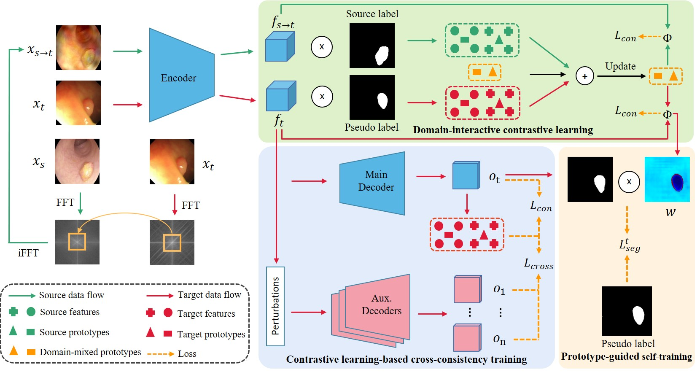
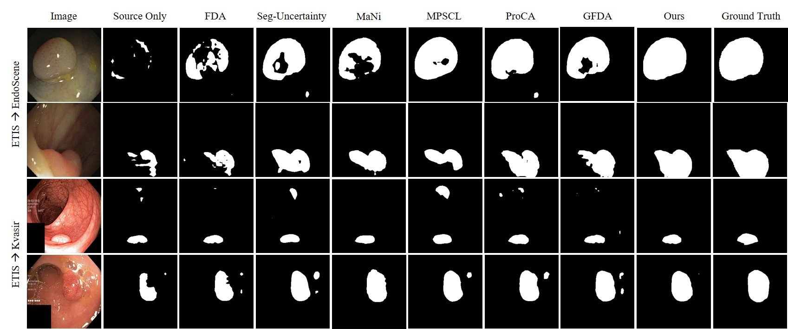

# Domain-interactive Contrastive Learning and Prototypeguided Self-training for Cross-domain Polyp Segmentation

> **Authors:** 

## 1. Preface

- This repository provides code for "_**Domain-interactive Contrastive Learning and Prototypeguided Self-training for Cross-domain Polyp Segmentation (DCLPS)**_" under review. 

## 2. Overview

### 2.1. Introduction

### 2.2. Framework Overview

      
    <em>
    Figure 1: Overview architecture of our model.
    </em>

### 2.3. Qualitative Results

      
    <em> 
    Figure 2: Qualitative Results.
    </em>

## 3. Proposed Baseline

### 3.1. Training/Testing

The training and testing experiments are conducted using [PyTorch](https://github.com/pytorch/pytorch) with 
a single Nvidia GeForce 3090.

1. Configuring your environment (Prerequisites):
   
   + Installing necessary packages: `pip install -r requirements.txt`.

2. Downloading necessary data:

   + DeepLab initialization can be downloaded through this [line](https://drive.google.com/file/d/1dk_4JJZBj4OZ1mkfJ-iLLWPIulQqvHQd/view?usp=sharing).
   
3. Training Configuration:

4. Testing Configuration:

### 3.2 Evaluating your trained model:

### 3.3 Pre-computed maps: 

## 4. Acknowledgments
This code is heavily based on the open-source implementations from [FDA](https://github.com/YanchaoYang/FDA) and [MPSCL](https://github.com/TFboys-lzz/MPSCL) 

## 5. Citation

Please cite our paper if you find the work useful: 
    

## 6. License

The source code is free for research and education use only. Any commercial use should get formal permission first.

